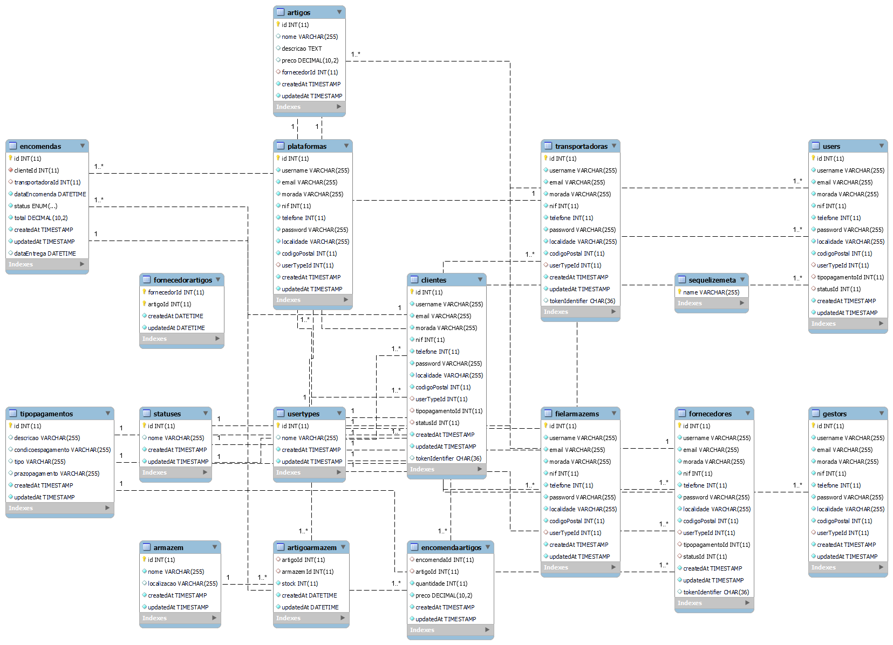

# Backend do Software de Logística - Passarinhos , Lda

- Cenário
  Com a velocidade requerida pelos negócios dos novos tempos cada vez mais temos assis􀆟do a uma
  digitalização de negócios mais tradicionais como por exemplo a gestão de stocks.
  Propomos-lhe o desafio de desenvolver o backend de um so􀅌ware de logística do armazém Pombo e
  Filhos lda.
  A empresa Pombo e Filhos lda, procede a compra e venda de material eletrónico e de iluminação.
  Os artigos adquiridos são guardados em armazém.
  O software a desenvolver deverá permitir:
- Gestão de fornecedores, tendo a noção de ficha de fornecedor tendo a noção de produtos fornecidos
- Gestão de Clientes, tendo noção de ficha de cliente e produtos adquiridos pelo mesmo
- Gestão de stocks de produtos em armazém
- Consulta de stock de determinado produto
- Datas de envio de encomendas;

## Resolução do Cenário .

1- Implementação da logica de base de dados.
1.1- logica da minha base de dados foi pensada da seguinte forma .

## Dificuldades e Melhoramentos.

1- O Sequelize, um ORM (Object-Relational Mapper) popular para Node.js, segue uma convenção de nomenclatura que cria automaticamente nomes de tabelas no plural. Esta é uma prática comum em muitos ORMs e frameworks, pois segue a convenção de que uma tabela, que geralmente armazena múltiplos registros, deve ter um nome que reflete seu conteúdo como uma coleção de entidades, que é mais naturalmente expresso no plural.
Daí muitas das minha tabelas serem no plurar .
2- Nome das funções ainda em aprendizagem da minha dificuldade, em Ingles ou Portuges.
3- Escolha de ter um uuid tambem foi um dos problemas a implementar.
4- Com as dificuladades encontradas viso meu melhoramento em termos de codigo nomes e funções .

## Apresentação do Projecto

Este projecto envolve o desenvolvimento do backend para um software de logística destinado à empresa Passarinhos , Lda, que se dedica à compra e venda de material electrónico e de iluminação. O objectivo é digitalizar e optimizar a gestão de stocks, fornecedores e clientes da empresa.

## Funcionalidades

- **Gestão de Fornecedores**: Permite o registo e gestão de fornecedores, incluindo informações sobre os produtos fornecidos.
- **Gestão de Clientes**: Facilita a criação e manutenção de fichas de clientes, assim como o registo de produtos adquiridos por estes.
- **Gestão de Stocks**: Oferece um sistema para a gestão de stocks de produtos no armazém, permitindo uma fácil consulta e controlo dos mesmos.
- **Consulta de Stock de Produtos**: Permite consultar o stock disponível de um determinado produto.
- **Gestão de Encomendas e Transporte**: Monitoriza as datas de envio de encomendas, assegurando um controlo eficaz sobre a logística de distribuição.

## Requisitos

- Tecnologias Usadas :
  faker-js/faker": "^8.2.0
  bcrypt": "^5.1.1
  chart.js": "^4.4.0
  cors": "^2.8.5
  dotenv": "^16.3.1
  ejs": "^3.1.9
  express": "^4.18.2
  jsonschema": "^1.4.1
  jsonwebtoken": "^9.0.2
  mysql": "^2.18.1
  nodemon": "^3.0.1
  passport": "^0.6.0
  passport-jwt": "^4.0.1
  react-chartjs-2": "^5.2.0
  sequelize": "^6.33.0
  sequelize-cli": "^6.6.1
  uuid": "^9.0.1

## Instalação e Configuração

- Instalação :
- npm install

- Migrações devido as necessidades das tabelas ordem é:

1- npx sequelize db:migrate --name 20231025003338-create-usertype.js
2- npx sequelize db:migrate --name 20231027123807-create-tipopagamento.js
3- npx sequelize db:migrate --name 20231027123750-create-status.js
4- npx sequelize db:migrate --name 20231106165811-create-fornecedorartigos.js
5- npx sequelize db:migrate --name 20231025202920-create-clientes.js
6- npx sequelize db:migrate --name 20231025204853-create-transportadora.js
7- npx sequelize db:migrate --name 20231106154749-create-artigos.js
8- npx sequelize db:migrate --name 20231106154126-create-armazem.js
9- npx sequelize db:migrate , migrar o restante das migrações.
10- npx sequelize db:seed:undo:all , preenche as colunas necessarias para funcionamento da aplicação
11 -nodemon src/server.js - arrancar servidor

## Uso da Aplicação

1- Versão V.1.
1.1- Versao actual.
1.2- Criação de artigos associados ao armazem e fornecedor .
1.3- Gestão de entregas com data de entrega e relatorio.
1.4- Compra de artigos
1.5- Edição perfil , fornecedor, clientes , transportadora .
1.6- Artigos com stock associados ao armazem.
1.7- Bloquear cliente e fornecedor .
1.8 - Grafico com estatisticas de entregas pela transportadora.

## Documentação da API

Em construção

## Contribuições

https://github.com/PedroSilvaSilva

# Licença

## Condições de Uso e Modificação

Este software é disponibilizado sob os termos desta licença, que permite o uso livre do software tal como está. No entanto, qualquer modificação, adaptação ou alteração do código-fonte requer autorização prévia e expressa do autor ou detentores dos direitos.

### Permissões

- **Uso**:Está autorizado a usar este software para qualquer propósito, incluindo aplicações comerciais, sem qualquer custo.

### Restrições

- **Modificação**: Não é permitido modificar, adaptar ou alterar o código-fonte deste software sem a prévia autorização escrita do autor ou detentores dos direitos.
- **Redistribuição**: Não é permitida a redistribuição de versões modificadas do software sem a autorização expressa do autor.

### Isenção de Responsabilidade

Este software é fornecido "como está", sem garantias de qualquer tipo, expressas ou implícitas. O autor não será responsável por quaisquer danos decorrentes do uso deste software.

---

Ao usar este software, concorda com os termos desta licença.

## Contacto e Suporte

https://github.com/PedroSilvaSilva

## Manutenção e Actualizações

2- Versão v.2, Novas Fucnionalidades.
2.1- Possobilidade de gestão de armazens , organização de Administrador.
2.2- Criação de contas com autenticação de dois fatores.
2.3- Criação de resportes personalizados .
2.4- Gestão de produtos entre gestão de numeros serie e familias.
2.5- Criaçã do Modulo inventarios .
